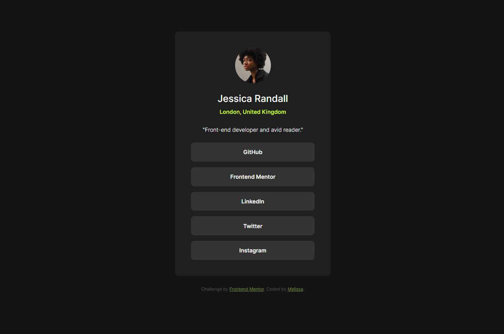
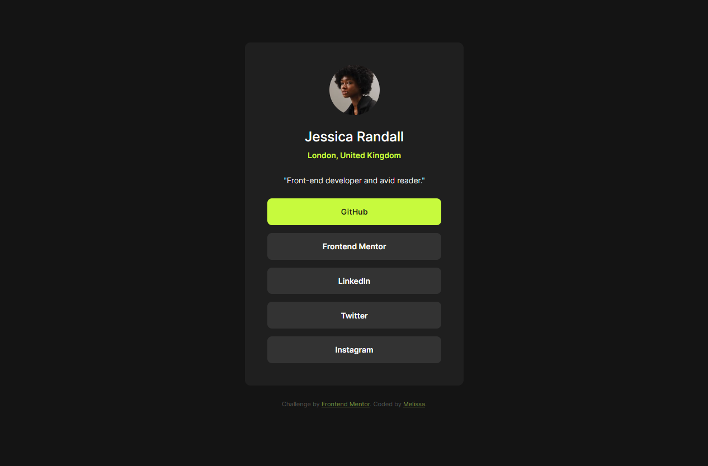

# Frontend Mentor - Social links profile solution

This is a solution to the [Social links profile challenge on Frontend Mentor](https://www.frontendmentor.io/challenges/social-links-profile-UG32l9m6dQ).

## Table of contents

- [Overview](#overview)
  - [The challenge](#the-challenge)
  - [Screenshot](#screenshot)
  - [Links](#links)
- [My process](#my-process)
  - [Built with](#built-with)
  - [What I learned](#what-i-learned)
  - [Continued development](#continued-development)
  - [Useful resources](#useful-resources)
- [Author](#author)

## Overview

### The challenge

Users should be able to:

- See hover and focus states for all interactive elements on the page

### Screenshot




### Links

- Solution URL: [https://github.com/MelissaZhuu/social-links-profile-main](https://github.com/MelissaZhuu/social-links-profile-main)
- Live Site URL: [https://melissazhuu.github.io/social-links-profile-main/](https://melissazhuu.github.io/social-links-profile-main/)

## My process

### Built with

- HTML5
- CSS
- Flexbox
- SASS

### What I learned

I learned some SASS features such as inheritance. I noticed that I could replace this repetitive code by extending this placeholder class.
```scss
%flexbox-layout {
    display: flex;
    flex-direction: column;
    justify-content: center;
    align-items: center;
}

body {
    @extend %flexbox-layout;
}

.card {
    @extend %flexbox-layout;
}
```
I also tried to have all units be responsive units and implement a media query for mobile screen sizes.

### Continued development

I would like to continue practicing different skills and tools in the future like using Bootstrap or Tailwind in the next one and maybe moving on to more complex challenges with Javascript.

### Useful resources

- [SASS Documentation](https://sass-lang.com/guide/#inheritance)
- [MDN Web Docs](https://developer.mozilla.org/en-US/docs/Web/CSS/@media)
- Stack Overflow, w3schools, MDN Web Docs, the usual...


## Author

- Website - [GitHub](https://github.com/MelissaZhuu)
- Frontend Mentor - [@MelissaZhuu](https://www.frontendmentor.io/profile/MelissaZhuu)